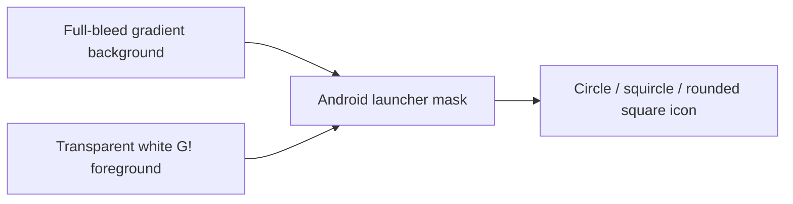

# Design Document: Gasp App Icon Replacement

## Overview

The feature replaces Expo starter artwork across the native device-branding
pipeline while preserving Gasp's current identity: a white `G!` over a
blue/purple/pink gradient.

The native operating systems render the same brand through different asset
contracts. A single PNG cannot serve all of them correctly:

- iOS and legacy Android need a complete full-bleed square icon.
- Android adaptive icons need independent foreground and background layers.
- Android themed icons need a monochrome glyph.
- Android notifications need a small all-white glyph on transparency.
- The splash screen needs a transparent logo over the existing dark canvas.

This design therefore derives a small, explicit asset family from the same
approved source.

## Source and constraints

- Brand source: `assets/images/gasp.png` and the approved product logo.
- Existing default assets are replaced in place where practical so Expo's
  default file conventions remain simple.
- Do not use the reaction-video watermark bitmap as a coloured launcher icon.
  It may be used as a geometry reference for the white `G!` glyph.
- Do not include a wordmark or additional text.
- Do not manually round the outer iOS icon. iOS masks the full square.

## Asset matrix

| Asset | Size | Alpha | Contents | Configuration consumer |
|---|---:|---|---|---|
| `assets/images/icon.png` | 1024×1024 | No | Full-bleed Gasp gradient + centred white `G!` | `expo.icon`, `android.icon` |
| `assets/images/android-icon-foreground.png` | 1024×1024 | Yes | White `G!` inside adaptive safe zone | `android.adaptiveIcon.foregroundImage` |
| `assets/images/android-icon-background.png` | 1024×1024 | No | Full-bleed Gasp gradient, no glyph | `android.adaptiveIcon.backgroundImage` |
| `assets/images/android-icon-monochrome.png` | 1024×1024 | Yes | Single-colour `G!` inside safe zone | `android.adaptiveIcon.monochromeImage` |
| `assets/images/notification-icon.png` | 96×96 | Yes | All-white `G!` glyph | `expo-notifications` plugin |
| `assets/images/splash-icon.png` | 1024×1024 | Yes | Gasp `G!` / approved mark with padding | `expo-splash-screen` plugin |

## Composition rules

### Complete icon

```text
┌──────────────────────────────┐
│ full-bleed Gasp gradient     │
│                              │
│          G!                  │
│                              │
│ no white outer margin        │
└──────────────────────────────┘
```

- The gradient reaches all four image edges.
- The `G!` is optically centred.
- The exclamation dot has comfortable spacing from the lower edge.
- No transparency or baked rounded corners.

### Android adaptive icon



- Foreground glyph stays within the central safe zone.
- Background and foreground share identical dimensions.
- The OS owns masking and motion.
- Monochrome uses the same glyph geometry without the gradient.

## Expo configuration

`app.json` retains the current top-level icon path and adaptive paths, but the
underlying files become Gasp assets. Add an explicit `android.icon` path for
legacy launchers and update the `expo-notifications` plugin to use the new
dedicated notification icon.

Expected configuration shape:

```json
{
  "expo": {
    "icon": "./assets/images/icon.png",
    "android": {
      "icon": "./assets/images/icon.png",
      "adaptiveIcon": {
        "foregroundImage": "./assets/images/android-icon-foreground.png",
        "backgroundImage": "./assets/images/android-icon-background.png",
        "monochromeImage": "./assets/images/android-icon-monochrome.png"
      }
    }
  }
}
```

The splash plugin keeps `backgroundColor: "#0A0A0F"`,
`resizeMode: "contain"`, and `imageWidth: 200`.

## Build and cache behaviour

App icons, Android notification icons, and splash artwork are native resources.
They require EAS Build or `npx expo run:ios` / `npx expo run:android`. They do
not update through an EAS OTA JavaScript update.

QA must uninstall the old app before validating a new build if the launcher
continues displaying a cached icon. An iOS Simulator may still reuse cached
icon resources when the bundle identifier and build number are unchanged. If
the icon changes after a SpringBoard refresh, compare the installed
`AppIcon60x60@2x.png` with the built app and repeat the clean install on a new
simulator or with a new build number. For splash QA, use a preview/production
build rather than Expo Go or a development build.

## QA matrix

| Platform | Surface | Expected result |
|---|---|---|
| iOS | Home screen | Full Gasp icon, no Expo “A”, no white gutter |
| iOS | App Library / search | Same crisp Gasp icon at small size |
| iOS | Notification badge | Badge sits on the OS-masked icon without covering `G!` recognition |
| Android | Circle launcher mask | `G!` and dot remain uncropped |
| Android | Squircle / rounded square | Gradient fills the shape; glyph remains centred |
| Android 13+ | Themed icon | Monochrome `G!` appears without a solid square |
| Android | Status bar notification | Small white Gasp glyph, no full-colour square |
| Android | Expanded notification | Gasp notification glyph remains recognisable |
| iOS / Android | Release splash | Gasp mark on `#0A0A0F`; no Expo/template artwork |

## Automated validation

The implementation should add a small asset validation script or equivalent
test that fails when:

- an asset path is missing;
- a required PNG has the wrong dimensions;
- the iOS/full icon contains transparency;
- a foreground, monochrome, notification, or splash asset lacks transparency;
- the notification icon is not 96×96;
- Expo config cannot resolve.

## Out of scope

- New logo exploration or brand redesign.
- App Store Connect or Google Play listing screenshots.
- Web favicon changes.
- Runtime UI logo changes.
- Changes to notification content or delivery.
- Dark/tinted iOS Icon Composer variants.

## References

- Expo, “Splash screen and app icon”:
  https://docs.expo.dev/develop/user-interface/splash-screen-and-app-icon/
- Expo SDK 54, app configuration:
  https://docs.expo.dev/versions/v54.0.0/config/app/
- Expo Notifications, notification icon configuration:
  https://docs.expo.dev/versions/v54.0.0/sdk/notifications/
