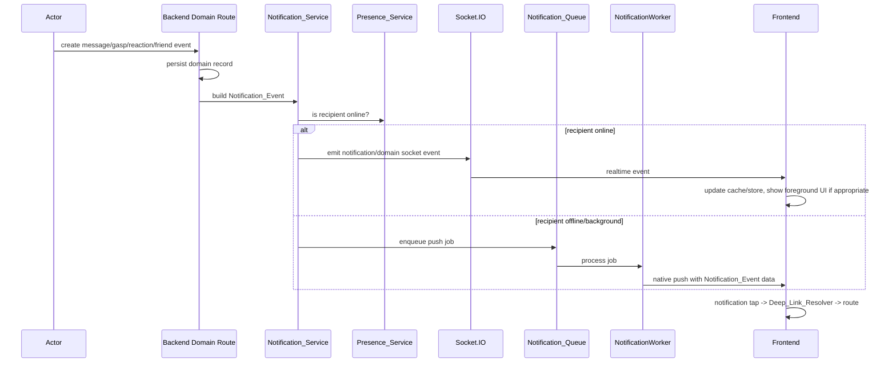

# Design Document: Gasp Notification MVP

## Overview

The Gasp Notification MVP standardizes the existing notification pieces into a single contract and delivery flow. The app already has:

- Expo push registration and push tap handling in `services/pushService.ts`
- Foreground toast UI in `components/notifications/ToastBanner.tsx`
- Notification UI state in `stores/notificationStore.ts`
- Socket listeners in `hooks/useSocketListeners.ts`
- Backend notification helpers in `gasp-backend/src/modules/notifications/notifications.service.ts`
- A BullMQ notification queue and worker in `gasp-backend/src/jobs/workers/notification.worker.ts`
- Presence detection through Socket.IO and Redis

The design keeps those pieces and refactors around one canonical `NotificationEvent`. The highest-risk current issues are contract drift, route drift, duplicate listeners, and missing notification wiring for messages/reactions.

### Key invariants

- The app and backend use the same `kind` values.
- Foreground delivery uses socket/UI, not native banners.
- Background delivery uses push.
- Tapping a notification never opens a stale route.
- Notification failure never rolls back the original domain action.
- The MVP avoids preferences, batching, notification history, and rich media pushes.

---

## Architecture

### High-level flow



### Delivery policy

```txt
Domain action succeeds
  -> build canonical Notification_Event
  -> if recipient is online: socket delivery
  -> else: push queue delivery
  -> if notification delivery fails: log and preserve domain action
```

The domain action is the source of truth. Notifications are best-effort side effects.

---

## Notification Contract

### Canonical type

```typescript
export type NotificationKind =
  | 'message.new'
  | 'gasp.received'
  | 'gasp.reaction_received'
  | 'friend.request'
  | 'friend.accepted';

export interface NotificationEvent {
  kind: NotificationKind;
  recipientId: string;
  actorId: string;
  actorName: string;
  title: string;
  body: string;
  route: string;
  conversationId?: string;
  gaspId?: string;
  reactionId?: string;
  eventId?: string;
}
```

### Event routes

| Kind | Required ID | Route |
|------|-------------|-------|
| `message.new` | `conversationId` | `/chat/:conversationId` |
| `gasp.received` | `gaspId` | `/(modals)/view-gasp?gaspId=:gaspId` |
| `gasp.reaction_received` | `gaspId` | `/(modals)/reaction-result?gaspId=:gaspId` |
| `friend.request` | none | `/(tabs)/discover` or `/(tabs)/inbox` |
| `friend.accepted` | none | `/(tabs)/chat` |

### Push data payload

The backend worker sends the full routing payload in `data`, not only the display text:

```typescript
{
  kind: event.kind,
  route: event.route,
  recipientId: event.recipientId,
  actorId: event.actorId,
  actorName: event.actorName,
  conversationId: event.conversationId ?? '',
  gaspId: event.gaspId ?? '',
  reactionId: event.reactionId ?? '',
  eventId: event.eventId ?? ''
}
```

FCM data values are strings. Optional values are omitted or serialized as empty strings, then normalized by the app.

---

## Backend Design

### Notification service

**File:** `gasp-backend/src/modules/notifications/notifications.service.ts`

The current helper functions are preserved but rewritten to build the canonical contract:

```typescript
export function buildMessageNotification(params): NotificationEvent
export function buildGaspReceivedNotification(params): NotificationEvent
export function buildReactionReceivedNotification(params): NotificationEvent
export function buildFriendRequestNotification(params): NotificationEvent
export function buildFriendAcceptedNotification(params): NotificationEvent

export async function deliverNotification(event: NotificationEvent): Promise<void>
```

`deliverNotification` decides whether to emit socket or enqueue push based on presence. It must catch/log failures so the caller does not roll back the domain action.

### Message flow

**Files:**
- `gasp-backend/src/socket/chat.gateway.ts`
- `gasp-backend/src/modules/messages/messages.service.ts`
- `gasp-backend/src/modules/conversations/conversations.service.ts`

When a message is created, the backend finds all participants except the sender and creates one `message.new` event per recipient. Sender self-notification is explicitly forbidden.

The message socket event still updates message caches. The notification event is responsible for foreground toast/tab behavior and offline push.

### Gasp flow

**File:** `gasp-backend/src/modules/gasps/gasps.routes.ts`

After `sendGasp` or `batchSendGasp` persists the gasp, the route builds and delivers `gasp.received` events. Each event includes `gaspId` and the actual route `/(modals)/view-gasp`.

### Reaction flow

**File:** `gasp-backend/src/modules/reactions/reactions.routes.ts`

After `createReaction` succeeds and the existing reaction chat message is created, the route builds and delivers `gasp.reaction_received` for the original gasp sender. The existing chat message behavior remains intact.

### Worker behavior

**File:** `gasp-backend/src/jobs/workers/notification.worker.ts`

The worker receives a canonical Notification_Event. It sends `notification: { title, body }` and `data` containing the canonical routing fields. It removes invalid device tokens after FCM failures.

---

## Frontend Design

### Deep link resolver

**File:** `gasp/services/pushService.ts` or new `gasp/services/notificationRouting.ts`

The resolver accepts the canonical payload:

```typescript
export function resolveNotificationRoute(event: Partial<NotificationEvent>): string
```

It returns a route for valid payloads and `/(tabs)/inbox` for unknown or incomplete payloads. It logs fallback cases to Sentry.

This replaces old route assumptions like `/(modals)/gasp-viewer`.

### Notification store

**File:** `gasp/stores/notificationStore.ts`

`ToastItem` becomes generic:

```typescript
interface ToastItem {
  id: string;
  kind: NotificationKind;
  title: string;
  body: string;
  route: string;
  actorName?: string;
  imageUri?: string;
  blurhash?: string;
  conversationId?: string;
  gaspId?: string;
  reactionId?: string;
}
```

The store dedupes active and queued toasts by `id`.

### Toast banner

**File:** `gasp/components/notifications/ToastBanner.tsx`

The banner becomes generic enough to display:

- New gasp
- New message
- Reaction received
- Friend request
- Friend accepted

It still supports gasp thumbnail/blurhash when available. On tap, it navigates to `toast.route` and dequeues.

### Socket listeners

**File:** `gasp/hooks/useSocketListeners.ts`

Responsibilities:

- Normalize socket payloads into cache/store updates.
- Deduplicate `gasp.received` by `gaspId`.
- Deduplicate `message.new` by `message.id`.
- Avoid unread increments if the active conversation is already open.
- Enqueue generic toasts when appropriate.

### Root layout

**File:** `gasp/app/_layout.tsx`

`useSocketListeners`, `useOnlineStatus`, and `useAutoDownload` must each be called once. Duplicate calls can register duplicate listeners and produce duplicate toasts.

---

## Dedupe Strategy

### Event IDs

Preferred IDs:

| Kind | Dedupe ID |
|------|-----------|
| `message.new` | `message.id` or `eventId` |
| `gasp.received` | `gasp.id` or `eventId` |
| `gasp.reaction_received` | `reaction.id` or `eventId` |
| `friend.request` | friendship/request ID or `eventId` |
| `friend.accepted` | friendship/request ID or `eventId` |

### UI state dedupe

- Toast store checks active toast and queued toasts before enqueue.
- Pending gasp cache checks existing `gasp.id` before prepend.
- Message cache already checks existing message IDs; unread increment must follow the same dedupe decision.

---

## Error Handling

### Backend

- Notification delivery is wrapped in `try/catch`.
- Delivery errors are logged with `kind`, `recipientId`, and relevant domain IDs.
- Domain actions return success even if notification delivery fails.
- Invalid push tokens are removed by the worker.

### Frontend

- Invalid notification payloads route to `/(tabs)/inbox`.
- Invalid payloads are logged to Sentry.
- Push token registration failures are logged and do not block auth/session restore.
- Foreground toast rendering must tolerate missing optional image fields.

---

## Testing Strategy

### Frontend tests

- `services/__tests__/pushService.test.ts` or `notificationRouting.test.ts`
  - Valid route for each `NotificationKind`
  - Fallback route for unknown kind
  - Fallback route for missing required IDs

- `stores/__tests__/notificationStore.test.ts`
  - Toast queue dedupes by ID
  - Separate IDs still queue normally
  - Active toast is considered during dedupe

- `hooks/__tests__/useSocketListeners.test.ts`
  - Duplicate gasp socket events do not duplicate pending gasps
  - Duplicate message socket events do not increment unread twice
  - Message in active conversation does not increment unread

### Backend tests

- Notification payload builder tests
  - `message.new` includes `conversationId`
  - `gasp.received` includes `gaspId` and `/(modals)/view-gasp`
  - `gasp.reaction_received` includes `gaspId` and `/(modals)/reaction-result`

- Delivery tests
  - Online recipient uses socket path
  - Offline recipient uses queue path
  - Sender is excluded from message recipients
  - Delivery failure does not throw to the domain route

---

## Rollout Plan

1. Fix root duplicate hook registration and route mismatch first.
2. Add canonical routing and frontend tests.
3. Add backend payload builders and tests.
4. Wire message, gasp, and reaction notification dispatch.
5. Make the toast generic and deduped.
6. Validate foreground and background behavior on device.

---

## Open Decisions

1. `friend.request` should route to `/(tabs)/discover` or `/(tabs)/inbox`. Product should choose one before implementation.
2. Foreground message toast should be enabled only when outside the active conversation. Product may choose whether it appears outside Chat entirely or only as tab indicator.
3. `eventId` can be introduced explicitly or derived from domain IDs for MVP. Explicit `eventId` is cleaner for future notification history.
