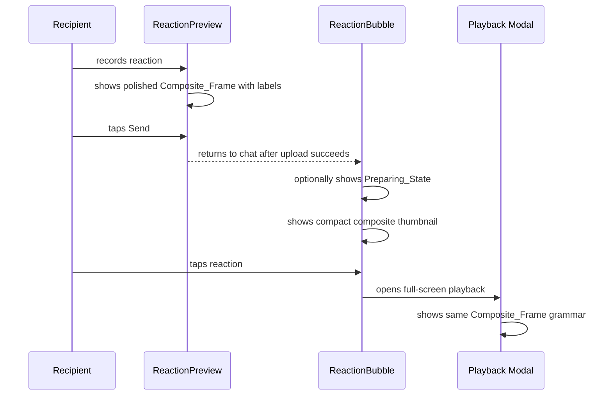
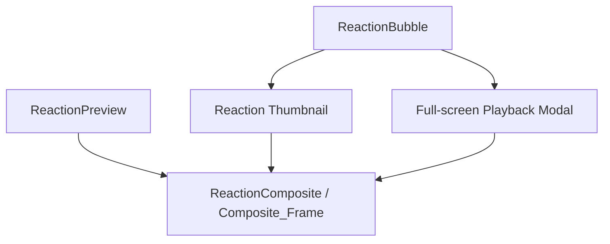

# Design Document: Reaction UI Polish

## Overview

The Reaction UI Polish feature makes the existing Super Imposed Reaction flow feel consistent from preview to chat to playback. The underlying composite contract remains unchanged: reaction on the left 1/3, original gasp on the right 2/3, backend payload `layout: "1/3-2/3"`. Full-screen playback is allowed to use a reaction-forward `45/55` presentation split so the sender can read the reaction face more clearly.

The current preview screenshot (`img-logs/2.jpeg`) is the baseline: it communicates the concept and gives the user clear actions. The current playback screenshot (`img-logs/3.jpeg`) is the anti-pattern: the media is shifted, large black Dead_Space appears, and the composite no longer feels intentional.

### Key invariants

- Do not change `useHoldGesture`.
- Do not change `ReactionCapture` recording behavior.
- Do not change `AVCAPTURE_SETTLE_MS`.
- Do not change upload, retry, or composite fallback logic.
- Do not change backend layout naming or FFmpeg output dimensions.
- Do not move server-state messages into Zustand; use React Query cache for any optimistic data state.
- Do not add raw `router.push` calls with params.
- Do not add new domain types outside Zod schemas. Component prop interfaces are allowed.
- Keep changed components under approximately 200 lines by extracting helpers when needed.
- Add new user-facing strings to locale files and read them through i18n.
- Keep the default visual ratio for preview and thumbnails: `reaction = 1`, `original gasp = 2`.
- Use the playback-only visual ratio for the fullscreen modal: `reaction = 45`, `original gasp = 55`.

---

## Architecture

### UI flow



### Component relationship



---

## Components and Interfaces

### 1. `ReactionComposite` — shared visual frame

**File:** `components/gasp/ReactionComposite.tsx`

`ReactionComposite` should become the reusable visual frame for preview and playback. It already owns the side-by-side layout; this polish pass adds optional labels and a more controlled presentation surface.

Proposed props:

```typescript
interface ReactionCompositeProps {
  originalUri: string;
  originalMediaType?: 'image' | 'video';
  reactionVideoUri: string;
  reactionLabel?: string;
  originalLabel?: string;
  showLabels?: boolean;
  showDivider?: boolean;
  watermarkMode?: 'hidden' | 'subtle';
  reactionFlex?: number;
  originalFlex?: number;
}
```

Default behavior:
- `showLabels = false` to avoid changing existing callsites unexpectedly.
- `showDivider = true`.
- `watermarkMode = 'hidden'` for client UI polish, unless product explicitly wants the badge visible.

Layout:

```text
+------------------+---------------------------------+
| You              | Mineiro's gasp                  |
|                  |                                 |
| reaction video   | original gasp                   |
| flex: 1          | flex: 2                         |
+------------------+---------------------------------+
```

Implementation notes:
- Use `flexDirection: 'row'` on the container.
- Reaction panel remains `flex: 1`.
- Original panel remains `flex: 2`.
- Playback may override those flex values to `45` and `55`; the default callsites must remain unchanged.
- Divider is an absolute or normal 1 px hairline between panels.
- Labels sit inside their respective panel near top-left with a compact translucent background.
- Media should fill each panel consistently. The current `contentFit="cover"` is acceptable for the composite panels, but manual QA must check that the reaction face does not look accidentally cropped.

### 2. `ReactionPreview` — polished review screen

**File:** `components/gasp/ReactionPreview.tsx`

Current strengths to preserve:
- Clear `Your Reaction` title.
- Sender context line.
- Large composite preview.
- Re-record, Send, Discard actions.

Design changes:
- Pass labels into ReactionComposite:

```tsx
<ReactionComposite
  originalUri={originalImageUri}
  originalMediaType={originalMediaType}
  reactionVideoUri={reactionVideoUri}
  reactionLabel="You"
  originalLabel={`${senderName}'s gasp`}
  showLabels
  showDivider
  watermarkMode="hidden"
/>
```

- Keep Send primary, but avoid low-contrast disabled text while `isSending`.
- Prefer app-aligned accent color over the current purple-heavy button if theme constants support it.
- Keep rounded corners restrained and consistent with existing components.
- Keep Discard lower emphasis.
- Source new visible strings from `locales/en.json` via the existing translation hook instead of hard-coded literals where the component currently supports translation work.

### 3. `ReactionBubble` — compact composite thumbnail

**File:** `components/chat/ReactionBubble.tsx`

Current issue:
- The reaction bubble is a generic gradient placeholder with a play button. It does not show the value of the composed reaction.

New behavior:
- If `resolvedMediaUri` and `resolvedOriginalUri` are both present, render a compact composite thumbnail.
- Preserve the reply strip above the bubble.
- Overlay the play icon in a small center control.
- Keep the existing generic placeholder path when original media is not available.

Suggested structure:

```tsx
{resolvedOriginalUri ? (
  <View style={styles.thumbnailFrame}>
    <ReactionComposite
      originalUri={resolvedOriginalUri}
      reactionVideoUri={resolvedMediaUri ?? ''}
      reactionLabel="You"
      originalLabel="Gasp"
      showLabels={false}
      showDivider
      watermarkMode="hidden"
    />
    <View style={styles.compactPlayButton}>...</View>
    <MediaBadge label="REACTION" variant="reaction" />
  </View>
) : (
  <ExistingReactionPlaceholder />
)}
```

Notes:
- Be careful with `ReactionBubble.tsx`; project guidance says Android JSX is fragile. Do not change the reply strip JSX. Prefer adding a small `ReactionThumbnail` helper for the media body and keep the outer bubble/strip structure stable.
- If video playback inside chat thumbnail is too heavy, use a muted/still preview for the original media and keep the reaction playable only in the modal. The visual shape still needs to communicate the composite.
- If the file approaches 200 lines, extract thumbnail/modal presentation into small helpers in `components/chat/` or shared styles in a sibling `*Styles.ts` file.

### 4. Full-screen playback modal

**File:** `components/chat/ReactionBubble.tsx`

Current issue from `img-logs/3.jpeg`:
- Media appears shifted to the right.
- Left side contains unintended black Dead_Space.
- The full-screen result does not match the preview.

New behavior:
- Modal background remains black, but top and stage composition should make the black surface feel intentional rather than empty.
- A lightweight top context row shows who reacted, e.g. `Alex reacted`, with a small avatar-initial treatment.
- Composite media sits inside a centered rounded stage (`~94%` width, large radius, overflow hidden).
- Full-screen playback uses a `45/55` split, making the reaction face large enough to read while keeping the original gasp slightly dominant.
- Labels sit inside the top of the rounded media stage over a dark scrim.
- Close button is safe-area aligned as a floating translucent circular control.
- No player controls, progress, mute, share, reply pill, or explanatory text in this pass.
- No unintended offset.

Suggested modal content:

```tsx
<View style={styles.modalContainer}>
  <View style={styles.topContext}>...</View>
  <View style={styles.playbackStage}>
    <LinearGradient ... />
    <View style={styles.stageLabels}>...</View>
  <ReactionComposite
    originalUri={resolvedOriginalUri}
    reactionVideoUri={resolvedMediaUri ?? ''}
    reactionLabel="You"
    originalLabel={replyToMessage ? "Gasp" : "Original"}
    showDivider
    watermarkMode="hidden"
    reactionFlex={45}
    originalFlex={55}
  />
  </View>
  <Pressable style={[styles.closeButton, { top: insets.top + 12 }]}>...</Pressable>
</View>
```

If the full-screen media appears too horizontally stretched on device, keep the rounded stage centered and tune height/maxHeight instead of reverting to a full-width hard rectangle. This prevents the black Dead_Space issue while keeping the output composition recognizable.

### 5. Preparing state

The current send flow navigates back after upload succeeds and then runs the composite request in the background. This should remain. A Preparing_State is optional because the current data model may not have a local optimistic message for this exact background job.

Preferred UI if supported:
- Use React Query cache for an optimistic message-like item. Do not add server messages to a Zustand store.
- Show a compact reaction bubble with a subtle loading indicator.
- Text: `Preparing reaction`.
- Replace it with the final reaction message once the message arrives.

Fallback if not supported:
- Keep the existing navigation behavior.
- Avoid adding blocking alerts for composite fallback.

---

## Visual QA Checklist

### Compare against `img-logs/2.jpeg`

- The preview still reads as `Your Reaction`.
- The composite remains large and understandable.
- The reaction panel is clearly the user's reaction.
- The original gasp remains visually dominant.
- Send/Re-record/Discard hierarchy is clear.
- Loading state keeps readable text contrast.

### Compare against `img-logs/3.jpeg`

- No large black region appears in the upper-left.
- Composite panels are not shifted outside the viewport.
- Close button does not obscure key media.
- Full-screen playback feels like the same artifact as preview.
- Labels clarify left/right panels.

---

## Testing Strategy

### Unit tests

- `ReactionComposite` renders optional labels.
- `ReactionComposite` preserves flex ratio.
- `ReactionPreview` passes `showLabels` and label props to `ReactionComposite`.
- `ReactionPreview` keeps Send disabled/loading when `isSending`.
- `ReactionBubble` renders compact composite thumbnail when original media exists.
- `ReactionBubble` falls back to placeholder when original media is missing.
- `ReactionBubble` modal renders `ReactionComposite` with labels.

### Manual tests

- iPhone simulator/device: record reaction to image gasp.
- iPhone simulator/device: record reaction to video gasp.
- Tap Send and confirm no blocking wait for composite generation.
- Open sent reaction from chat and verify full-screen playback has no Dead_Space.
- Validate small-screen text and button fit.
