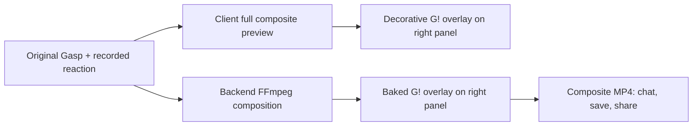

# Reaction Video `G!` Watermark — Design

**Status:** Follow-up required — enable watermark in source-composed chat thumbnail

## UX direction

The finished reaction is the hero; the Gasp mark is a quiet signature. The
black UI, white labels, and dark controls already used in the reaction result
screen remain unchanged. The watermark is intentionally not a promotional
element.

```text
┌──────────────────────── 1080px composite ────────────────────────┐
│                         reaction composite                         │
│                                                                    │
│       Reaction panel              Original Gasp panel              │
│         360px wide                   720px wide                    │
│   ┌────────────────┬───────────────────────────────────────────┐  │
│   │                │                                           │  │
│   │      You       │                 Bi's gasp                 │  │
│   │                │                                           │  │
│   │                │                                           │  │
│   │                │                                           │  │
│   │                │                                      G!   │  │
│   └────────────────┴───────────────────────────────────────────┘  │
│                                                  24px →  ↑ 36px   │
└────────────────────────────────────────────────────────────────────┘
```

## Visual token

| Property | Specification |
|---|---|
| Mark | Official Gasp `G!` glyph only |
| Source asset | New transparent PNG (minimum 256×256) derived from the approved logo; no app-icon tile |
| Colour | `#FFFFFF` |
| Opacity | 70% |
| Shadow / edge | Black at 35% opacity, 1–2px equivalent blur/offset; no solid background |
| Export size | 64×64px in a 1080×1920 composite |
| Export inset | 24px right, 36px bottom |
| Client size | Match the 64/1080 = 5.9% width ratio, clamped so it remains recognisable in a full-size preview |
| Layering | Above original media and below no interactive controls; never on the reaction panel |

The master asset should contain only the white glyph with alpha. Opacity and
contrast treatment are applied at render time so the asset stays reusable.

## Rendering model

There are two rendering surfaces. Both are required because client-only UI
overlays disappear when a video is exported.



### Client preview

- Extend the existing `watermarkMode` in `ReactionComposite` to render the
  actual `G!` image rather than the current empty rounded placeholder view.
- Enable the mode in full-size `ReactionPreview` and `ReactionPlaybackModal`.
- Enable it in `ReactionThumbnail` when the thumbnail is composed from the raw
  reaction and original source assets. This preserves preview parity with the
  opened reaction.
- Do not add a client overlay to a server-generated composite that already
  contains the baked mark.
- Place the overlay as a child of the original/right panel. This keeps the
  position correct if the composite container is resized or shown in a modal.
- Set the image to `pointerEvents="none"` / equivalent decorative behaviour.

### Server-generated composite

- Add the new watermark PNG to a backend-owned build path that is copied into
  the final FFmpeg runtime image. Do not depend on the mobile app bundle at
  runtime.
- Treat the PNG as a third FFmpeg input and loop it for the output duration.
- After the existing reaction/original `hstack`, apply the overlay filter using
  the fixed 1080×1920 output coordinates: `x = main_w - overlay_w - 24`,
  `y = main_h - overlay_h - 36`.
- Scale the watermark to 64×64 before it is overlaid and apply the 70% alpha
  and subtle dark contrast treatment in the filter graph, or supply an
  equivalent pre-composited treatment. The final result must meet the visual
  token table.
- Preserve the existing output dimensions, encoding settings, source media
  fitting, duration rules, and reaction-audio mapping.

## Current-code integration map

| Area | Current state | Intended change when implementation is approved |
|---|---|---|
| `gasp/components/gasp/ReactionComposite.tsx` | `watermarkMode="subtle"` currently draws an empty translucent rounded square at the composite bottom-right | Render the real `G!` glyph inside the original panel with the defined treatment. |
| `gasp/components/gasp/ReactionPreview.tsx` | Passes `watermarkMode="hidden"` | Enable the subtle glyph for the full preview. |
| `gasp/components/chat/ReactionPlaybackModal.tsx` | Passes `watermarkMode="hidden"` for its full composite | Enable the subtle glyph for full playback. |
| `gasp/components/chat/ReactionThumbnail.tsx` | Passes `watermarkMode="hidden"`; confirmed missing in `img-logs/30.png` | Use `subtle` for source-composed thumbnails so the chat preview matches full-screen playback. |
| `gasp-backend/src/modules/composite/composite.service.ts` | Builds a two-input FFmpeg side-by-side composite; comments/tests say watermark was removed by an earlier product decision | Add a required third watermark input and overlay stage. |
| `gasp-backend/Dockerfile` | Already has an asset-copy step intended for an FFmpeg filtergraph | Point this at the new backend-owned watermark asset and verify it is present in the runtime image. |
| Existing tests | Tests currently assert hidden/removed watermark behaviour | Replace only the obsolete assertions with the acceptance checks in this spec. |

## Explicit non-decisions

- This spec does not define a paywall or a watermark-removal entitlement.
- This spec does not alter privacy or save permissions; those remain covered by
  F11.
- This spec does not define a visual safe-area detector. The deterministic
  lower-right placement is the approved MVP behaviour.
- This spec does not change the 1/3 reaction / 2/3 original layout.

## Risks and mitigations

| Risk | Mitigation |
|---|---|
| White mark disappears on a waterfall, sky, or white wall | Require the subtle dark edge/shadow and validate with bright-media fixtures. |
| Client preview differs from exported MP4 | Use the same proportional sizing and right-panel anchoring; conduct visual comparison as a release gate. |
| Missing production asset silently produces unbranded media | Make the FFmpeg overlay a required composition step and fail the job on asset/filter errors. |
| A full-colour app icon feels like an ad | Use the white, transparent-background glyph only. |
