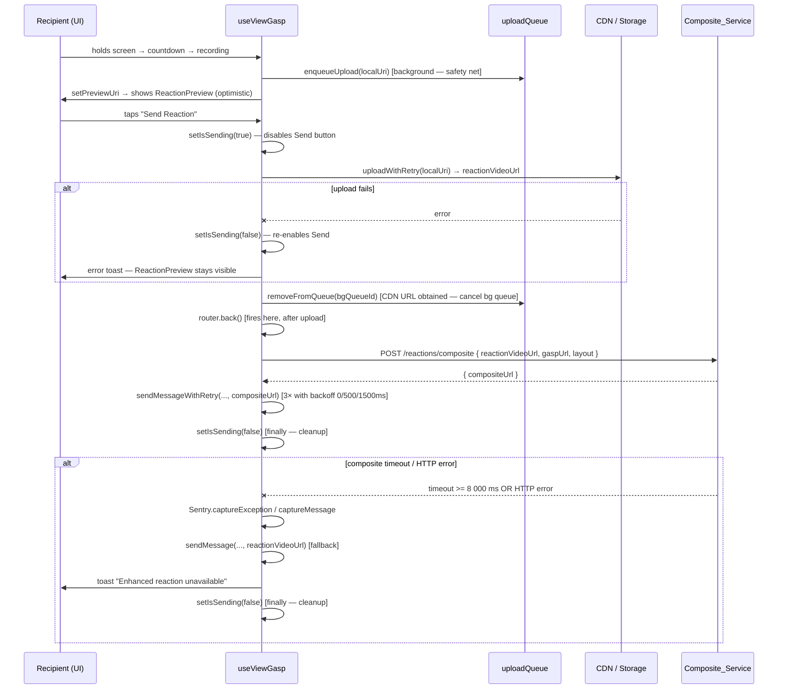
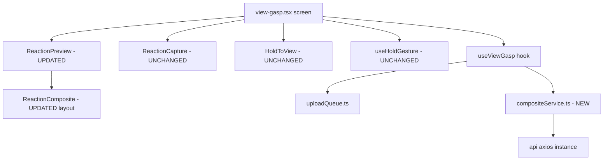

# Design Document: Super Imposed Reaction

## Overview

The Super Imposed Reaction feature augments the existing reaction flow so the sender receives a single composited video — the original gasp on the right 2/3 of a 9:16 frame, and the recipient's reaction on the left 1/3 — instead of a raw front-camera clip. Composition is performed **server-side via FFmpeg** (Option D). The client flow is extended minimally: it records, uploads, and calls a new `/reactions/composite` endpoint. A client-side `ReactionComposite` component provides an **optimistic preview** while the server job runs. Navigation remains non-blocking.

### Key invariants

- `AVCAPTURE_SETTLE_MS = 2 000 ms` is untouched.
- `ReactionCapture` (PiP 120 × 160 px, draggable corners) is untouched.
- `HoldToView` is untouched.
- `useHoldGesture` is untouched.
- All HTTP goes through the existing `api` axios instance (JWT injected automatically).

---

## Architecture

### High-level flow



### Component interaction



---

## Components and Interfaces

### 1. `ReactionComposite` — layout change

**File:** `components/gasp/ReactionComposite.tsx`

Current render: gasp fullscreen background + reaction PiP top-right (32% width).
New render: side-by-side — reaction left 1/3, gasp right 2/3.

The `captureRef` / `forCapture` props are removed because composition happens server-side.

```typescript
// Props (updated)
interface ReactionCompositeProps {
  originalUri: string;
  originalMediaType?: 'image' | 'video';
  reactionVideoUri: string;
  // captureRef and forCapture REMOVED
}
```

Layout uses a horizontal `flexDirection: 'row'` container:

```
+------------------+---------------------------------+
|  reaction video  |        original gasp            |
|    (flex: 1)     |          (flex: 2)              |
|     ~1/3 width   |          ~2/3 width             |
+------------------+---------------------------------+
        [GASP watermark — bottom-right of container]
```

Both panels fill the full container height (`flex: 1` on the container). The watermark `View` is `position: 'absolute'`, bottom-right, `width = containerWidth * 0.12`, `opacity = 0.7`. Container width is measured via `onLayout`.

### 2. `ReactionPreview` — activity indicator + send disabled state

**File:** `components/gasp/ReactionPreview.tsx`

Two new props added:

```typescript
interface ReactionPreviewProps {
  // ... existing props unchanged ...
  /** True while foreground upload or composite job is in flight after Send tap */
  isSending?: boolean;
}
```

Behaviour changes:
- Send button renders `ActivityIndicator` instead of `Send` icon when `isSending === true`.
- Send button `disabled` + reduced opacity while `isSending`.
- `originalImageUri` prop is used for preview display; the CDN gaspUrl is passed via `useViewGasp` to the composite payload and does not need to flow through ReactionPreview into ReactionComposite (the local URI is sufficient for the optimistic preview display).

### 3. `useViewGasp` — new state, refs, and send path

**File:** `hooks/useViewGasp.ts`

#### New state and refs

```typescript
const compositeAbortControllerRef = useRef<AbortController | null>(null);
const [isSending, setIsSending] = useState(false);
```

`bgUploadQueueIdRef` already exists.

#### Props: `gaspUrl` added

```typescript
interface UseViewGaspProps {
  // ... existing props ...
  /** Remote CDN URL of the original gasp — required for composite payload */
  gaspUrl: string;
}
```

#### Updated `handleSend`

The key fix from the original design: `router.back()` is called **after** the foreground upload succeeds, not before. If the upload fails, `ReactionPreview` stays visible with the Send button re-enabled.

```typescript
const handleSend = useCallback(() => {
  if (!previewUri || isSending) return;
  const localUri = previewUri;
  setIsSending(true);
  // NOTE: router.back() is NOT called here — it fires after upload succeeds

  const userId = user?.id ?? 'guest';

  (async () => {
    try {
      // 1. Foreground upload (bg queue still active as safety net during upload)
      let reactionVideoUrl: string;
      try {
        const result = await uploadWithRetry(localUri, 'reactions', userId);
        reactionVideoUrl = result.downloadUrl;
      } catch (e) {
        // Upload failed — keep ReactionPreview visible, re-enable Send button
        Sentry.captureException(e, { tags: { feature: 'super-imposed-reaction', step: 'upload' } });
        setIsSending(false);   // ← re-enable Send button
        showUploadErrorToast();
        return;
      }

      // 2. Upload succeeded — cancel bg queue entry (already have the CDN URL)
      if (bgUploadQueueIdRef.current) {
        await removeFromQueue(bgUploadQueueIdRef.current).catch(() => {});
        bgUploadQueueIdRef.current = null;
      }

      // 3. Navigate back immediately after upload, before composite job
      setPreviewUri(null);
      router.back();   // ← fires here, after upload, before composite

      // 4. Composite request with 8 000 ms AbortController timeout (fire-and-forget)
      const controller = new AbortController();
      compositeAbortControllerRef.current = controller;
      const timeoutId = setTimeout(() => controller.abort(), 8_000);
      const payload = buildCompositePayload(reactionVideoUrl, gaspUrl);

      try {
        const { compositeUrl } = await compositeReaction(payload, controller.signal);
        clearTimeout(timeoutId);
        await sendMessageWithRetry(conversationId, compositeUrl, messageId, 3);
        reactionSucceededRef.current = true;
      } catch (e: unknown) {
        clearTimeout(timeoutId);
        const isAbort = e instanceof Error && e.name === 'AbortError';
        if (isAbort) {
          Sentry.captureMessage('Composite job timed out', {
            extra: { durationMs: 8_000, payload },
            tags: { feature: 'super-imposed-reaction' },
          });
        } else {
          Sentry.captureException(e, {
            extra: { payload },
            tags: { feature: 'super-imposed-reaction' },
          });
        }
        // Fallback: send raw reaction video
        sendMessage(conversationId, '[Reaction]', 'reaction', reactionVideoUrl, messageId || undefined);
        reactionSucceededRef.current = true;
        showFallbackToast();
      } finally {
        compositeAbortControllerRef.current = null;
        setIsSending(false);   // ← always reset, even though screen is gone
      }
    } catch (e) {
      // Unexpected outer error
      Sentry.captureException(e, { tags: { feature: 'super-imposed-reaction', step: 'outer' } });
      setIsSending(false);
    }
  })();
}, [previewUri, isSending, gaspUrl, conversationId, messageId, user, sendMessage]);
```

`sendMessageWithRetry` is a private helper inside `useViewGasp` that calls `sendMessage` up to N times with delays of `[0 ms, 500 ms, 1 500 ms]` between attempts, preserving the same `url` across all retries.

`showFallbackToast` / `showUploadErrorToast` trigger the existing app toast mechanism with a 3 000 ms auto-dismiss.

#### Updated `handleDiscard`

```typescript
const handleDiscard = useCallback(() => {
  router.back();                                           // immediate
  compositeAbortControllerRef.current?.abort();            // cancel composite
  compositeAbortControllerRef.current = null;
  if (bgUploadQueueIdRef.current) {
    removeFromQueue(bgUploadQueueIdRef.current).catch(() => {});
    bgUploadQueueIdRef.current = null;
  }
  const id = gaspIdRef.current;
  if (id) closeViewMutation.mutate(id);
}, [closeViewMutation]);
```

#### Return value additions

```typescript
return {
  // ... existing return values ...
  isSending,   // new — passed to ReactionPreview
};
```

### 4. `compositeService.ts` — new service

**File:** `services/compositeService.ts`

```typescript
import { api } from '@/services/api';

export interface CompositePayload {
  reactionVideoUrl: string;
  gaspUrl: string;
  layout: '1/3-2/3';
}

export interface CompositeResult {
  compositeUrl: string;
}

/** Pure function: always returns layout="1/3-2/3" regardless of input order/count. */
export function buildCompositePayload(
  reactionVideoUrl: string,
  gaspUrl: string,
): CompositePayload {
  return { reactionVideoUrl, gaspUrl, layout: '1/3-2/3' };
}

/**
 * Request a server-side composite video.
 * Caller must pass a signal from an AbortController with an 8 000 ms timeout.
 */
export async function compositeReaction(
  payload: CompositePayload,
  signal: AbortSignal,
): Promise<CompositeResult> {
  const response = await api.post<CompositeResult>(
    '/reactions/composite',
    payload,
    { signal },
  );
  return response.data;
}
```

### 5. `view-gasp.tsx` screen — prop threading

New search params: `chatGaspUrl` (remote CDN URL for chat-mode gasps).

```typescript
const params = useLocalSearchParams<{
  // ... existing params ...
  chatGaspUrl?: string;   // NEW: remote CDN URL for composite payload
}>();
```

`gaspUrl` resolution:

```typescript
const gaspUrl = params.chatGaspUrl || gasp?.imageUrl || imageUri;
```

This is passed into `useViewGasp({ gaspUrl })` and forwarded to `compositeReaction`.

---

## Data Models

### `CompositePayload`

```typescript
{
  reactionVideoUrl: string;  // CDN URL from uploadWithRetry
  gaspUrl: string;           // CDN URL of original gasp
  layout: '1/3-2/3';        // only supported value
}
```

### `CompositeResult`

```typescript
{
  compositeUrl: string;  // CDN URL of merged video
}
```

### `GaspSchema` addition

`imageUrl: z.string()` added to `GaspSchema` (alongside existing `imageUri`) so the CDN URL survives the media cache replacement.

### `useViewGasp` state additions

| Field | Type | Purpose |
|---|---|---|
| `isSending` | `boolean` | `true` from Send tap until upload fails (stays on screen) or composite resolves/fails (after navigation). Always reset to `false` in the `finally` block. |
| `compositeAbortControllerRef` | `RefObject<AbortController \| null>` | Cancels composite HTTP on Discard |

---

## gaspUrl Threading

### Root cause

`normalizePendingGasp` maps `imageUrl` (API CDN URL) → `imageUri`. After `mediaCache.ts` processes the gasp, `imageUri` becomes a `file://` path. The composite payload requires the CDN URL, not the local path.

### Solution

1. **Add `imageUrl` to `GaspSchema`** — stored alongside `imageUri`, never overwritten by cache.
2. **Inbox mode**: `gaspUrl = gasp.imageUrl`
3. **Chat mode**: chat screen passes `chatGaspUrl` search param (the original `mediaUrl` from the message) when navigating to `view-gasp`.
4. **Fallback**: empty `gaspUrl` → composite returns 422 → fallback path sends raw `reactionVideoUrl`.

### Data flow

```
Backend API (imageUrl = CDN URL)
    ↓
normalizePendingGasp → Gasp.imageUrl = CDN URL, Gasp.imageUri = CDN URL
    ↓
mediaCache.ts → Gasp.imageUri = file:// path  |  Gasp.imageUrl = CDN URL (unchanged)
    ↓
view-gasp.tsx
  imageUri  → HoldToView, ReactionPreview display (local or CDN)
  gaspUrl   → useViewGasp → compositeReaction payload  (always CDN)
```

---

## Data Flow Diagram

```
[User holds screen]
        │
        ▼
  handleCountdownComplete()
   ├── isRevealed → 1
   ├── startProgressAnimation()
   └── setTimeout(startRecording, AVCAPTURE_SETTLE_MS=2000ms)
              │
              ▼
        recordAsync({ maxDuration: min(holdDurationS, 30) })
              │
              ▼
  [User releases / timer ends]
  handleRelease()
   ├── stopRecording()
   ├── await recordingPromise → videoUri
   ├── enqueueUpload(videoUri) → bgQueueId     [background upload — safety net]
   └── setPreviewUri(videoUri)                 [ReactionPreview shown]

[User sees ReactionPreview — optimistic composite visible immediately]

[User taps "Send Reaction"]
  handleSend()
   ├── setIsSending(true)                      [disables Send button]
   ├── uploadWithRetry(localUri) → reactionVideoUrl
   │     ├── [failure] setIsSending(false) + error toast
   │     │   → ReactionPreview stays visible, user can retry
   │     └── [success] continue ↓
   ├── removeFromQueue(bgQueueId)              [cancel bg queue — CDN URL already obtained]
   ├── setPreviewUri(null)
   ├── router.back()                           [fires here, after upload, < 500ms from success]
   └── async fire-and-forget:
        ├── new AbortController(); setTimeout(abort, 8000)
        ├── compositeReaction(payload, signal)
        │     ├── [success] sendMessageWithRetry(..., compositeUrl)
        │     │   delays: [0ms, 500ms, 1500ms] between attempts
        │     └── [failure] Sentry log + sendMessage(..., reactionVideoUrl) + toast
        └── setIsSending(false)                [in finally — state cleanup even after nav]

[User taps "Discard"]
  handleDiscard()
   ├── router.back()
   ├── compositeAbortControllerRef.current?.abort()
   ├── removeFromQueue(bgQueueId)
   └── closeViewMutation.mutate(gaspId)  [inbox mode only]
```

---

## Error Handling

| Scenario | Action | Sentry | User visible |
|---|---|---|---|
| Foreground upload fails | `setIsSending(false)`; keep ReactionPreview; re-enable Send button; show toast | `captureException` (from `uploadWithRetry`) | Error toast, Send button re-enabled, can retry |
| Composite HTTP error | Fallback: `sendMessage` with `reactionVideoUrl` | `captureException` + payload as `extra` | Toast |
| Composite timeout >= 8 000 ms | Abort; fallback `sendMessage` with `reactionVideoUrl` | `captureMessage` + duration + payload as `extra` | Toast |
| `sendMessage` fails (composite) | Retry up to 3× with delays [0ms, 500ms, 1500ms], same `compositeUrl` | `captureException` on exhaustion | None |
| `sendMessage` fails (fallback) | Single attempt | `captureException` | None |
| Composite 422 `unreachable_input` | Same as HTTP error | Same | Toast |
| `gaspUrl` empty | Composite → 422 → fallback path | Same | Toast |

---

## Correctness Properties

*A property is a characteristic or behavior that should hold true across all valid executions of a system — essentially, a formal statement about what the system should do. Properties serve as the bridge between human-readable specifications and machine-verifiable correctness guarantees.*

### Properties Overview

Before listing properties, the prework classifications were reviewed for redundancy:

- **2.5** (payload layout invariant) and **9.8** (buildCompositePayload layout invariant) are the same invariant expressed at different abstraction levels. They collapse into a single property covering `buildCompositePayload`.
- **9.2–9.5** (dimension, duration, audio, idempotence) are independent server-side properties — no overlap.
- **1.3** (ring animation duration) and **1.6** (duration clamping) are independent pure-function properties.
- **3.3** (watermark size), **5.1** (fallback URL), **4.2** (retry URL preservation) are independent.
- **9.6** (bad layout → 400) and **9.7** (bad MIME → 422) are independent error conditions.

After reflection: 12 properties remain. No further consolidation is warranted.

---

### Property 1: Composite payload always carries the fixed layout

*For any* pair of non-empty URL strings `reactionVideoUrl` and `gaspUrl`, calling `buildCompositePayload(reactionVideoUrl, gaspUrl)` SHALL return an object whose `layout` field equals `"1/3-2/3"`, regardless of the order, content, or number of times the function is called.

**Validates: Requirements 2.5, 9.8**

---

### Property 2: Reaction duration is clamped to MAX_REACTION_DURATION_S

*For any* `holdDurationS` in the range `[1, infinity)`, `reactionDurationS = Math.min(holdDurationS, 30)` SHALL satisfy `reactionDurationS <= 30` and equal `holdDurationS` when `holdDurationS <= 30`.

**Validates: Requirements 1.6**

---

### Property 3: Ring animation completes at the same time as recording ends

*For any* `maxDurationS` in `[1, 30]`, the ring progress animation in `ReactionCapture` SHALL reach its terminal value (`ringProgress = 1`) at the same elapsed time as `recordAsync` would reach its `maxDuration` limit — i.e., both use the same duration value `maxDurationS * 1 000` ms as their time base. This is verified by observing that the `withTiming` duration passed equals `maxDurationS * 1 000` rather than testing any internal Reanimated API.

**Validates: Requirements 1.3**

> Note for test implementation: test the observable state — use `jest.useFakeTimers()` and advance by `maxDurationS * 1000` ms, then assert `ringProgress` shared value equals `1` (or a value within epsilon of 1). Do NOT import or spy on `withTiming` directly.

---

### Property 4: Watermark size is proportional to component width

*For any* positive `componentWidth`, the rendered watermark width inside `ReactionComposite` SHALL equal `componentWidth * 0.12` (within floating-point rounding) and the watermark opacity SHALL equal `0.7`.

**Validates: Requirements 3.3**

---

### Property 5: Fallback always sends the exact reaction video URL

*For any* non-empty `reactionVideoUrl` string, when the Composite_Service times out or returns an HTTP error, `sendMessage` SHALL be called with that exact `reactionVideoUrl` as the `mediaUrl` argument — not a transformed or truncated version.

**Validates: Requirements 5.1**

---

### Property 6: sendMessage retries preserve the same compositeUrl

*For any* `compositeUrl` string, when `sendMessage` fails and is retried up to 3 times, all retry attempts SHALL pass the identical `compositeUrl`. It SHALL NOT be mutated, replaced, or re-fetched across retries.

**Validates: Requirements 4.2**

---

### Property 7: Composite output dimensions are always 1 080 x 1 920

*For any* valid `reactionVideoUrl` and `gaspUrl` combination, the video returned at `compositeUrl` SHALL have `width = 1 080 px` and `height = 1 920 px`, regardless of the input video dimensions or aspect ratios.

**Validates: Requirements 9.2**

---

### Property 8: Composite output duration matches reaction duration within tolerance

*For any* reaction video with `duration` in `(0, 30]` seconds, the composite video duration SHALL satisfy `|composite.duration - reaction.duration| <= 0.5 s`.

**Validates: Requirements 9.3**

---

### Property 9: Composite output has exactly one audio track from the reaction video

*For any* composite job with any gasp type (image or video, with or without audio), the output video SHALL contain exactly one audio track, and its content SHALL be derived from the reaction video audio.

**Validates: Requirements 9.4**

---

### Property 10: Composite processing is deterministic on dimensions and near-identical on duration

*For any* identical pair of `(reactionVideoUrl, gaspUrl)` inputs submitted twice, both output videos SHALL have identical `width` and `height` and `|duration_a - duration_b| <= 0.5 s`.

**Validates: Requirements 9.5**

---

### Property 11: Unsupported layout value always returns HTTP 400

*For any* `layout` value not in the set `{ "1/3-2/3" }`, the Composite_Service SHALL return HTTP 400 with `code = "unsupported_layout"`.

**Validates: Requirements 9.6**

---

### Property 12: Unsupported input MIME type always returns HTTP 422

*For any* input URL (`reactionVideoUrl` or `gaspUrl`) that resolves to a MIME type not in `{ video/mp4, video/quicktime, video/webm, image/jpeg, image/png, image/webp }`, the Composite_Service SHALL return HTTP 422 with `code = "invalid_media_type"`.

**Validates: Requirements 9.7**

---

## Testing Strategy

### Dual testing approach

Unit tests cover specific examples, call-order contracts, and UI states. Property tests verify universal invariants across generated inputs. Both are required for comprehensive coverage — unit tests catch concrete bugs in specific paths; property tests verify that correctness holds across the full input space.

### Property-based testing library

**fast-check** (`fc`) — well-established in the TypeScript ecosystem, no native modules required, works in Jest/Vitest.

Minimum **100 iterations** per property test. Each test must include a comment in the tag format:

```typescript
// Feature: super-imposed-reaction, Property N: <property_text>
```

### Client-side property tests

**File:** `services/__tests__/compositeService.test.ts`

| Property | fast-check arbitraries |
|---|---|
| 1: `buildCompositePayload` layout invariant | `fc.string()` x 2 |

**File:** `hooks/__tests__/useViewGasp.compositeFlow.test.ts`

| Property | fast-check arbitraries |
|---|---|
| 2: Duration clamping | `fc.integer({ min: 1, max: 120 })` |
| 5: Fallback sends exact reactionVideoUrl | `fc.webUrl()`, `fc.oneof(fc.constant('timeout'), fc.constant('httpError'))` |
| 6: sendMessageWithRetry preserves compositeUrl (tested via handleSend) | `fc.webUrl()` |

**File:** `components/__tests__/ReactionComposite.test.tsx`

| Property | fast-check arbitraries |
|---|---|
| 3: Ring completes at `maxDurationS * 1000` ms (observable via fake timers) | `fc.integer({ min: 1, max: 30 })` |
| 4: Watermark width = componentWidth * 0.12 | `fc.integer({ min: 100, max: 800 })` |

### Server-side property tests (integration)

These run against the Composite_Service in a test environment with real FFmpeg processing.

**File:** `services/__tests__/compositeService.integration.test.ts`

| Property | fast-check arbitraries |
|---|---|
| 7: Output dimensions always 1080 x 1920 | Sampled input resolution pairs (360p, 720p, 1080p, portrait, landscape) |
| 8: Duration within 0.5s of reaction | `fc.float({ min: 0.5, max: 30 })` (seconds) |
| 9: Exactly one audio track from reaction | Various gasp types (silent image, silent video, audio video) |
| 10: Deterministic dimensions and near-identical duration | Fixed URL pairs submitted twice |
| 11: Unsupported layout → HTTP 400 | `fc.string().filter(s => s !== '1/3-2/3')` |
| 12: Invalid MIME → HTTP 422 | URLs resolving to text/plain, application/json, etc. |

### Unit tests (example-based)

**File:** `hooks/__tests__/useViewGasp.test.ts`

- `handleRelease` calls `enqueueUpload` and stores queueId in `bgUploadQueueIdRef`.
- `handleSend` calls `removeFromQueue` before `uploadWithRetry` (verified via spy call order).
- `handleSend` calls `router.back()` synchronously before async upload starts.
- `handleDiscard` calls `router.back()` first, then `abort()`, then `removeFromQueue`.
- `handleDiscard` calls `closeViewMutation.mutate` only when `gaspIdRef.current` is non-null.
- When foreground upload fails, `isSending` resets and error toast is shown.
- On composite HTTP error, `Sentry.captureException` called with payload as `extra`.
- On composite timeout, `Sentry.captureMessage` called with duration + payload as `extra`.

**File:** `components/__tests__/ReactionPreview.test.tsx`

- Send button is disabled and shows `ActivityIndicator` when `isSending=true`.
- Send button is enabled and shows `Send` icon when `isSending=false`.

**File:** `components/__tests__/ReactionComposite.test.tsx`

- Renders side-by-side layout (reaction left flex=1, gasp right flex=2).
- Watermark rendered with `opacity=0.7` at bottom-right.
- `captureRef` and `forCapture` props are no longer accepted (type check).

**File:** `services/__tests__/compositeService.test.ts`

- `compositeReaction` calls `api.post('/reactions/composite', payload, { signal })`.
- `compositeReaction` rejects when the `AbortSignal` is aborted before the request completes.

### iOS-first testing hierarchy

Manual QA order: iPhone 17 Pro Max → iPhone 16 Pro → iPhone 15 → older supported hardware.

Focus areas for manual testing:
- AVAudioSession release timing on video gasps (AVCAPTURE_SETTLE_MS).
- AbortController abort on Discard mid-upload.
- Composite job timeout (simulate slow network) → fallback toast appears.
- ReactionComposite side-by-side layout renders correctly across screen sizes.

---

## Known Trade-offs and Follow-up Tickets

### FU-1: iOS background suspension after router.back()

After `router.back()` fires, the composite job and `sendMessage` continue as fire-and-forget async work. If the user immediately sends the app to background, iOS may suspend the JS thread before these calls complete. The existing `bgUploadQueueIdRef` / `enqueueUpload` safety net covers the upload, but the composite request and `sendMessage` are not protected.

**MVP trade-off:** Acceptable for launch. The fallback path (`reactionVideoUrl` from the queue) is the safety net.

**Follow-up:** Investigate `expo-task-manager` with a background fetch task that retries a pending composite+sendMessage job stored in AsyncStorage when the app returns to foreground. Scope is a separate spec.
